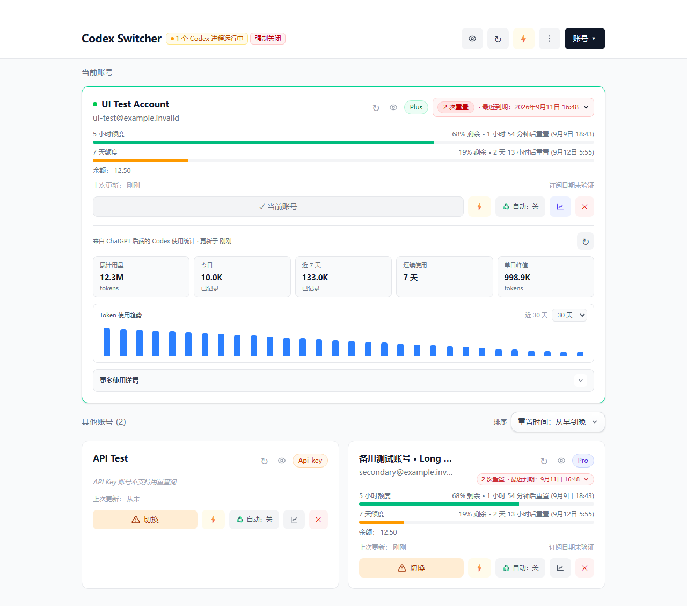
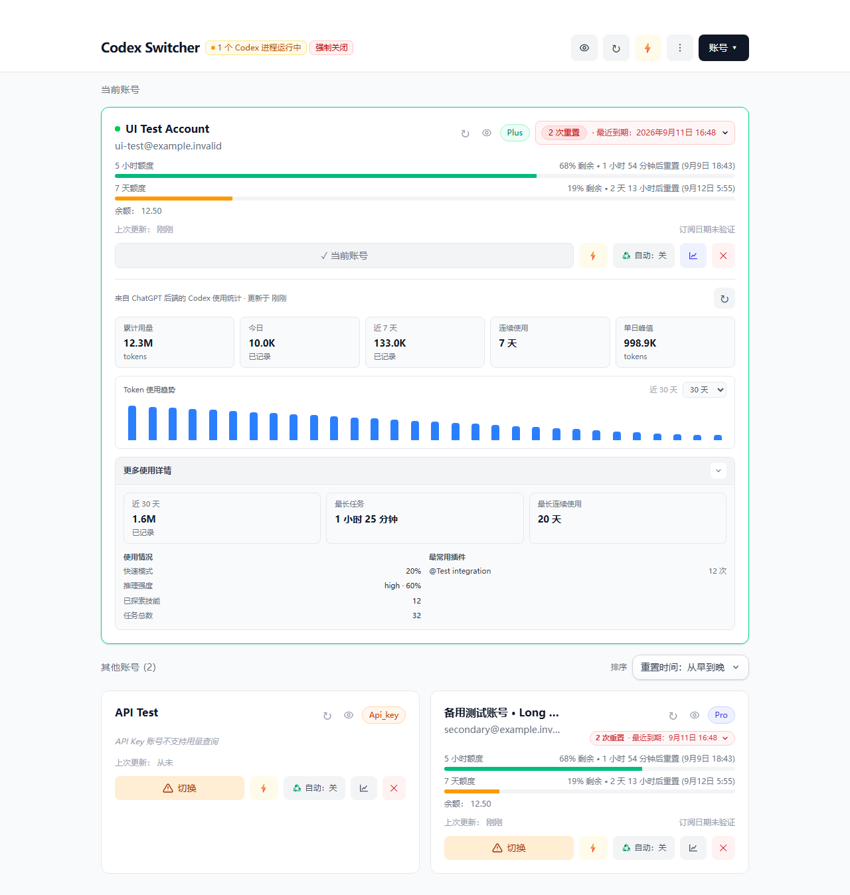
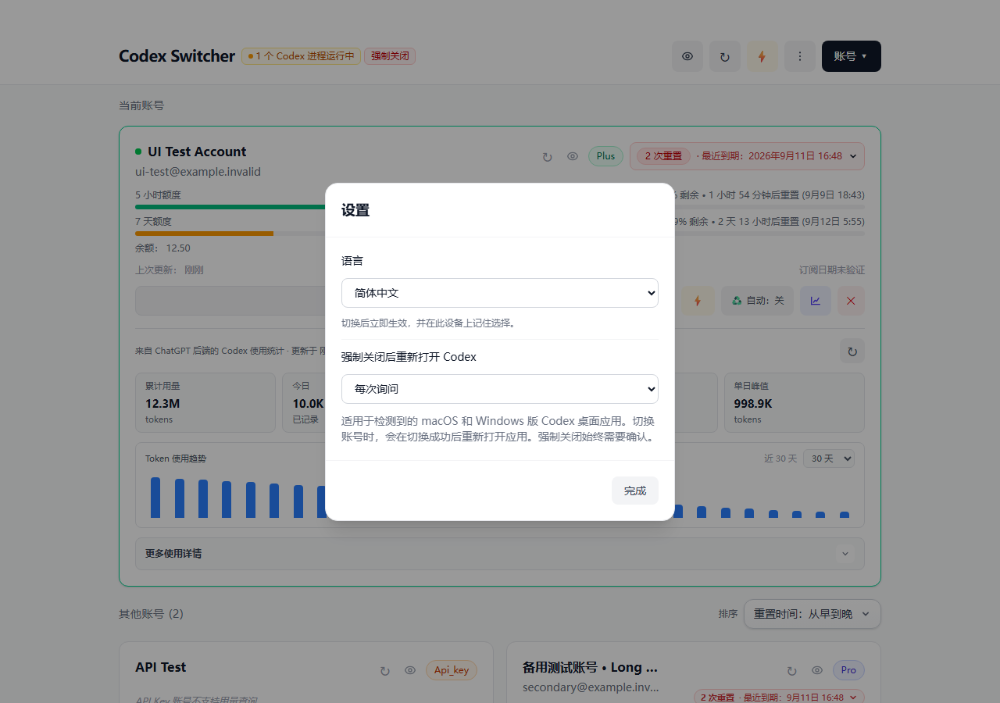
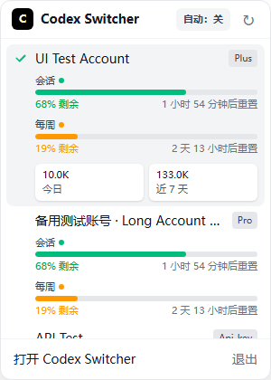
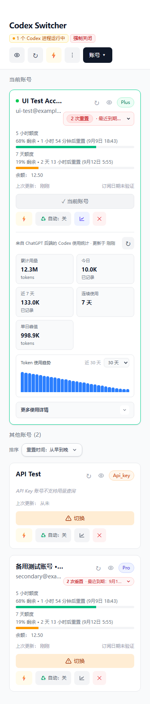

<p align="center">
  
</p>

<h1 align="center">Codex Switcher</h1>

<p align="center">
  用于管理多个 OpenAI <a href="https://github.com/openai/codex">Codex</a> 账号的桌面应用<br>
  轻松切换账号、查看用量、安排预热，并掌握额度状态
</p>

## 软件截图

<p align="center">
  <a href="docs/截图/主界面.png"></a>
</p>
<p align="center"><sub>桌面主界面：账号额度、重置券、预热和使用趋势</sub></p>

<table>
  <tr>
    <td width="50%" align="center"><a href="docs/截图/使用统计.png"></a></td>
    <td width="50%" align="center"><a href="docs/截图/设置.png"></a></td>
  </tr>
  <tr>
    <td align="center"><sub>使用统计详情</sub></td>
    <td align="center"><sub>语言与账号切换设置</sub></td>
  </tr>
</table>

<p align="center">
  <a href="docs/截图/托盘.png"></a>
</p>
<p align="center"><sub>托盘弹窗：无需打开主窗口即可查看额度和切换账号</sub></p>

<details>
  <summary>查看移动端浏览器管理面板</summary>
  <p align="center">
    <a href="docs/截图/移动端.png"></a>
  </p>
</details>

> 截图使用脱敏测试账号和隔离数据，不包含真实账号或凭据。点击图片可查看原图。

## 功能特性

- **中文 / English**：在 **菜单 → 设置 → 语言** 中即时切换。应用首次启动时跟随系统语言，记住手动选择，并同步主窗口和托盘弹窗的语言。
- **多账号管理**：在一个应用中添加、重命名、隐藏、导入、导出和管理多个 Codex 账号。
- **快速切换账号**：从主窗口、原生托盘菜单或托盘弹窗切换账号，同时保留 ChatGPT 轮换后的最新会话令牌。
- **使用统计**：查看 OAuth 账号的累计 Token、每日用量、连续使用天数、活跃情况和常用集成等统计信息。
- **手动重置券**：在账号套餐标记旁查看可用的手动重置次数，并在最近一张重置券即将到期时突出提醒。
- **自动预热**：支持手动预热单个或全部账号，也可在每个 5 小时窗口重置后自动预热，或按每天的指定时间执行。
- **系统托盘控制**：通过托盘弹窗切换账号、查看额度和当前账号统计、刷新用量、打开主窗口或退出应用。
- **Windows 动态额度图标**：任务栏和通知区域图标显示当前账号最紧张额度窗口的剩余百分比，并按额度状态改变颜色。
- **托盘显示模式**：可显示应用图标和 5 小时剩余额度、仅显示 5 小时/每周额度文字，或隐藏托盘图标。
- **macOS 程序坞控制**：可让应用保留在程序坞中，或仅在菜单栏运行；首次关闭窗口时会询问行为，并保留托盘入口。
- **额度监控**：实时查看 5 小时和每周额度的剩余比例、重置时间、余额及订阅期限。
- **切换受阻恢复**：检测正在运行的 Codex 会话，并在重试账号切换前提供强制关闭流程。
- **两种登录方式**：支持 ChatGPT OAuth 登录，也可导入已有的 `auth.json` 文件。

## 安装

### 下载发行版

最简单的安装方式是从 GitHub 下载最新发行版：

[下载最新发行版](https://github.com/csdjk/codex-switcher/releases/latest)

当前发行版提供 Windows x64 安装包：

- **推荐安装程序**：`Codex.Switcher_*_x64-setup.exe`
- **MSI 安装包**：`Codex.Switcher_*_x64_en-US.msi`
- **文件校验值**：`SHA256SUMS.txt`

macOS 和 Linux 暂未提供预编译安装包，可以按下方步骤从源码构建。

### 自动更新

当前仓库的发行版尚未配置独立的自动更新签名，请从 [Releases](https://github.com/csdjk/codex-switcher/releases) 页面手动下载新版本。完成签名配置后再恢复应用内自动更新。

### 从源码构建

#### 环境要求

- [Node.js](https://nodejs.org/)（v18 或更高版本）
- [pnpm](https://pnpm.io/)
- [Rust](https://rustup.rs/)

```bash
# 克隆仓库
git clone https://github.com/csdjk/codex-switcher.git
cd codex-switcher

# 安装依赖
pnpm install

# 以开发模式运行
pnpm tauri dev

# 构建生产版本
pnpm tauri build
```

> **Windows：**`pnpm tauri` 脚本通过 POSIX Shell 包装器（`sh ./scripts/tauri.sh`）运行，无法直接在 PowerShell 或 CMD 中使用。请改用 `tauri:win` 脚本：`pnpm tauri:win dev` 和 `pnpm tauri:win build`。

构建产物位于 `src-tauri/target/release/bundle/`。

### 在浏览器中运行管理面板

除 Tauri 桌面外壳外，也可以通过 HTTP 提供已构建的管理面板。

```bash
# 构建前端，并在 0.0.0.0:3210 启动 Web 服务
pnpm lan
```

可选环境变量：

- `CODEX_SWITCHER_WEB_HOST`：修改监听地址。
- `CODEX_SWITCHER_WEB_PORT`：修改监听端口。

浏览器管理面板通过 `/api/invoke/*` 提供与桌面应用相同的界面和后端操作。安全开放所选端口后，可通过局域网、Tailscale 或远程主机隧道访问。

## 用量与重置券

### 中英文切换

打开右上角 **菜单 → 设置 → 语言**，选择「简体中文」或「English」。首次启动时，中文系统默认使用中文，其他系统默认使用英文；手动选择会保存在当前设备上，网页版则按浏览器来源保存。

切换语言会立即生效，并且不会清空正在填写的账号名称。主界面、账号卡片、用量统计、订阅日期、重置券、弹窗和托盘页面均支持双语。账号名称、邮箱、插件名称以及服务器返回的原始错误详情保持原样，便于识别和排查。

验证记录与复测步骤见 [中英文切换验收](docs/中英文切换验收.md)。

### 用量信息

Codex Switcher 会显示三类账号使用信息：

- **额度窗口**：账号卡片显示当前 5 小时和每周额度窗口，包括剩余比例、重置时间、余额，以及接口可用时的订阅期限。
- **使用统计**：ChatGPT OAuth 账号可展开 **使用统计** 面板，查看累计 Token、今日用量、最近 7 天、最近 30 天、连续使用天数、最长任务、Token 趋势、推理与活跃情况，以及最常使用的集成。当前账号默认展开此面板，其他账号按需展开。
- **手动重置券**：有可用重置券的 OAuth 账号会在套餐标记旁显示紧凑提示，包括可用数量和最近到期日期。数量为零时不显示；距离到期不足 10 天时变为橙色，不足 3 天时变为红色。

托盘弹窗还会显示当前账号今日和最近 7 天的简要统计，同时与额度刷新流程保持独立。

## 安全切换账号

ChatGPT 在使用 OAuth 刷新令牌后可能会下发新的令牌，旧令牌随后可能失效。在 Codex Switcher 将其他账号写入 `~/.codex/auth.json` 前，会先保存当前账号的最新令牌，因此切回该账号时恢复的是最新会话，而不是旧快照。

令牌刷新和账号切换会串行执行，避免后台刷新延迟完成后覆盖刚刚选择的账号。Codex 或 ChatGPT 正在运行时，Codex Switcher 也会避免刷新当前账号；请先关闭正在运行的应用，再切换账号。

如果旧版 Codex Switcher 已经保存了无效刷新令牌，请重新登录该账号，或删除后重新添加一次。已经失效的令牌无法在本地恢复。

## macOS 程序坞与菜单栏模式

在 macOS 上，Codex Switcher 可以保留在程序坞中，也可以仅在菜单栏运行。第一次关闭主窗口时，应用会询问希望采用哪种行为，并允许设置以后是否继续显示该提示。

之后可在托盘弹窗或原生托盘菜单的 **程序坞图标** 中修改同一设置。选择 **仅菜单栏** 后，应用仍会保留可见的托盘入口，方便重新打开主窗口或切回程序坞模式。

## 账号预热

预热会向账号发送一次真实的最小模型请求，让当前额度窗口在正式使用前产生一次活动。预热会消耗极少量真实额度，不会增加额度，也不会提升模型速度。

- **手动预热**：从主窗口或托盘菜单立即预热单个或全部账号。
- **自动预热**：为单个或全部账号启用后，应用会优先跟踪 5 小时窗口，并在每次重置后预热一次，前提是每周额度尚未耗尽。如果只能取得每周窗口，则在每周重置后预热一次；5 小时窗口重新出现后会自动恢复按 5 小时窗口执行。
- **定时预热**：在主窗口的 **定时** 设置中选择每天的具体时间，例如 `08:00`、`13:00`、`18:00`。到达设定时间后，应用会预热所有符合条件的账号，并跳过每周额度已经耗尽的账号，从而让 5 小时窗口尽量按预期时间开始。

定时预热每 30 秒检查一次计划，同一分钟每天只执行一次。如果电脑在目标时间处于休眠状态，唤醒后会跳过已经错过的时间，不会延迟补发预热请求。

在 macOS 上，可以使用系统自带的 `caffeinate` 命令保持电脑唤醒；应用退出后，该命令会自动结束：

```bash
caffeinate -i -w "$(pgrep -x 'Codex Switcher')"
```

## 使用声明

本工具**仅供个人管理本人拥有的多个 OpenAI/ChatGPT 账号**，目的是让个人账号管理更加方便。

**本工具不用于：**

- 多人共享账号。
- 绕过 OpenAI 的服务条款。
- 任何形式的账号池或凭据共享。

使用本软件即表示你确认自己是所添加账号的合法所有者。作者不对滥用本软件或违反 OpenAI 服务条款的行为负责。

## 版本管理

使用版本更新脚本，可以让 Tauri、Cargo 和前端中的应用版本保持一致。

```bash
# 指定确切版本
pnpm version:bump 0.2.1

# 按语义化版本递增
pnpm version:patch
pnpm version:minor
pnpm version:major

# 创建发行提交和标签
# 命令会先要求输入简短的发行说明，再更新版本号
pnpm release patch

# 创建并推送发行版本
# 标签会保存发行说明，供应用内更新提示使用
pnpm release patch -- --push

# 非交互环境中可直接传入发行说明
pnpm release patch -- --push --note "修复账号切换问题"
```
