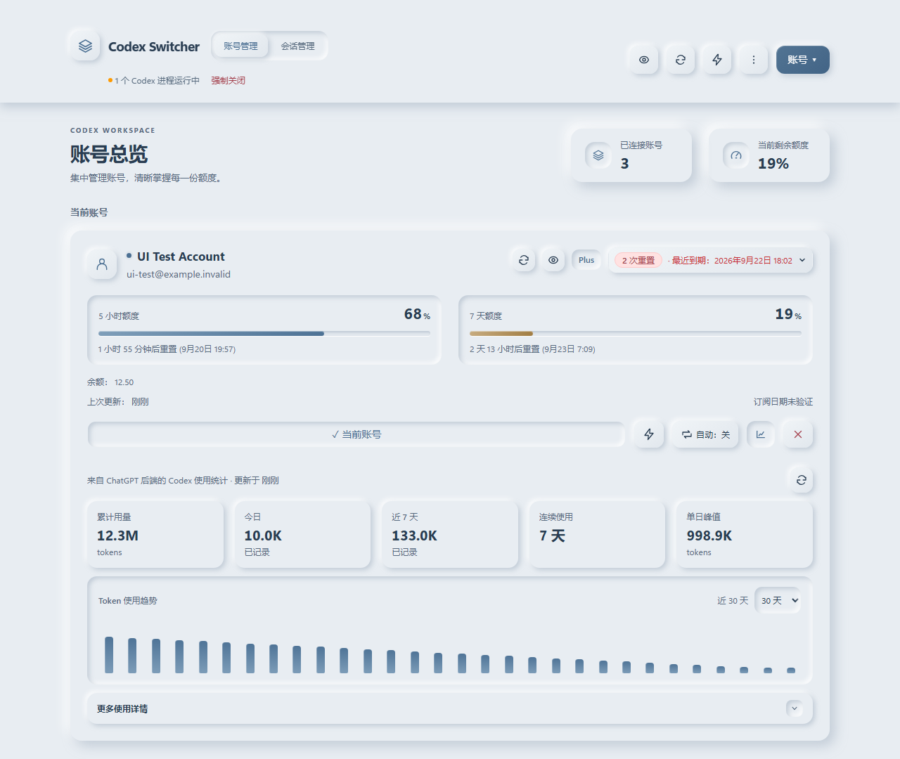
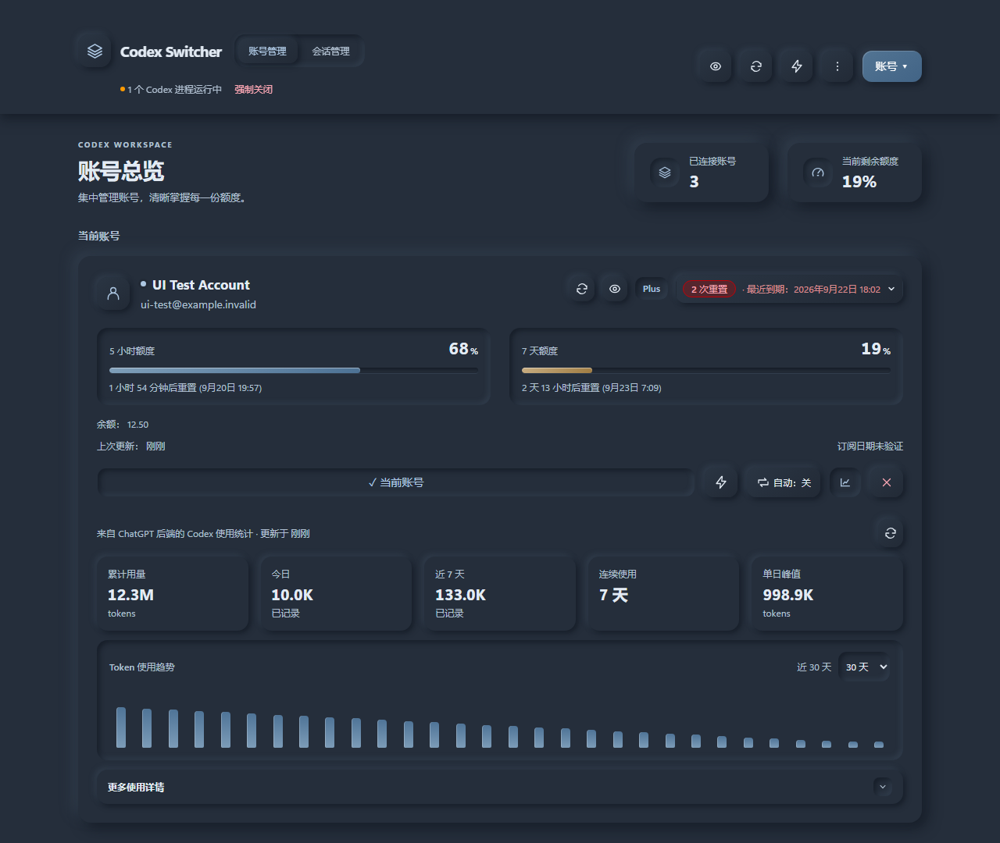
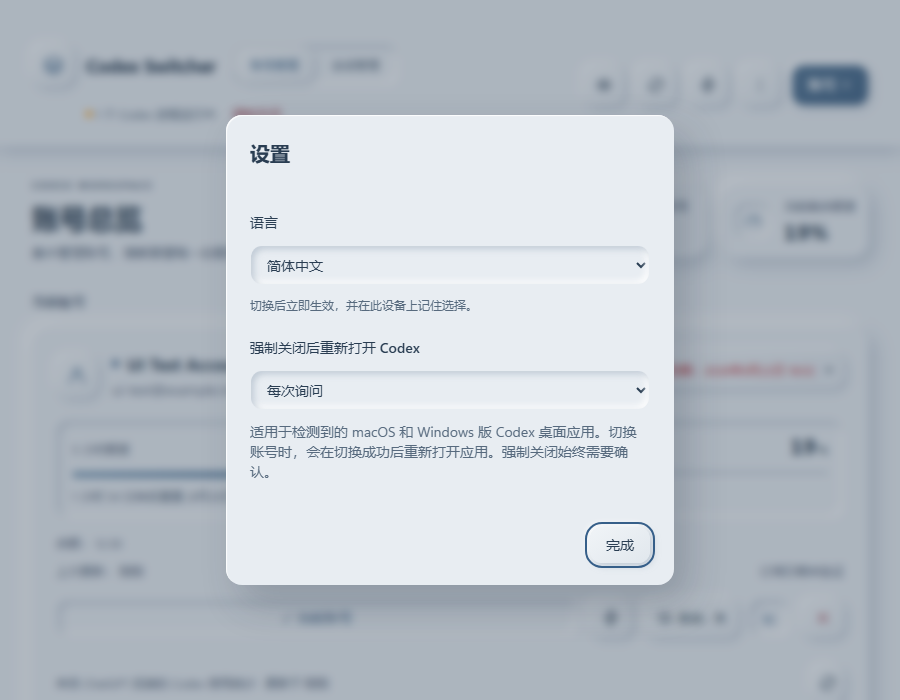
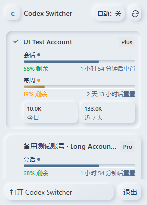
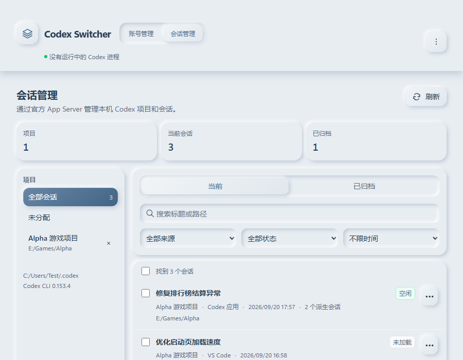

# 新拟态界面设计与验收

日期：2026-09-20。根据 UI UX Pro Max 的 Neumorphism 风格规范，在现有 React/Tauri 项目中实现 Mist 雾蓝灰主题。本轮只修改工作区并运行测试版，不提交、不推送、不发布，不覆盖正式安装目录。

## 界面预览

以下图片均来自实际 React 组件配合隔离测试数据的截图，不是效果图，不包含真实账号、凭据或用户会话。

## 实现

- 统一雾蓝灰材质、12–16px 圆角、左上柔光与右下柔影；卡片、统计块和按钮采用外凸效果，输入框、额度槽、图表及选中控件采用内凹效果。
- 保留深色模式与既有语言偏好。普通操作统一单色，只为危险操作和低额度保留必要的语义提示色。
- 顶部加入只读账号总览：账号数量和当前账号最低剩余额度，直接使用已加载数据，不增加网络查询。
- 统一主要结构图标为本地 SVG；保留现有账号管理、导入导出、更新源、原生任务栏圆环和服务端代码。
- 补充弹窗 Tab 焦点范围、Escape 退出和关闭后的焦点返回；账号名称支持键盘重命名；图表数据可获得键盘焦点；减少动画与系统高对比模式有独立规则。
- 设计规范见 [MASTER](../design-system/codex-switcher/MASTER.md)。主题入口为 `src/styles/neumorphism.css`，主要组件使用 `neu-*` 语义类。

## 验证结果

- TypeScript 类型检查、Vite 生产构建、`git diff --check` 通过。
- 23 项现有前端单元测试通过，包含更新源、版本比较、重开应用流程、语言和重置券。
- 原有中英文界面回归通过：1280×900、320×568、375×667、390×844。检查了主页面、表单内容保留、设置、导入错误、确认弹窗和主题同步。检查中发现英文工具栏在 320px 下溢出 8px，已修复并重新通过。
- 新增 `tests/neumorphism.browser.cjs`：6 种尺寸、深浅主题和 38 张截图检查通过；包含 900×700 原生默认窗口规格、600px 窄桌面、375/320px 窄屏与 812×375 横屏。验证弹窗焦点不逃逸、Escape 关闭后返回入口、进度数值范围和减少动画。
- 会话管理原有隔离回归通过，覆盖 900×700 和 600×500，运行时错误数组为空。
- 更新提示 8 项隔离场景通过；文件选择器在 1000×800 和 375×667 的选择、取消、重选及异常路径通过。
- 核心文字 token 对比度：浅色正文 9.46:1、次级文字 4.73:1；深色正文 11.39:1、次级文字 7.39:1。该检查不等同于全部控件或完整无障碍认证。
- Windows 原生 Debug 构建成功，测试程序已启动且响应正常，UI Automation 确认新界面“已连接账号”标签已加载。为与仍在运行的安装版区分，本次临时将测试窗口标题设为“Codex Switcher — 新拟态预览”。

Windows 未允许工具自动将新窗口置前；请通过任务栏或 Alt+Tab 选择上述预览窗口。本轮未宣称完整原生视觉回归、macOS/Linux 实机验证或真实账号变更测试。公开预览只使用隔离数据；正式安装版保持原样。

## 复测

先运行 `pnpm dev --host 127.0.0.1 --port 3218`，再运行 `pnpm test:neumorphism-ui`。也可使用 `UI_BASE_URL` 指定其他本地 Vite 地址。截图及报告输出到 `Temp/neumorphism-qa/`，其他现有测试保持原命令。
