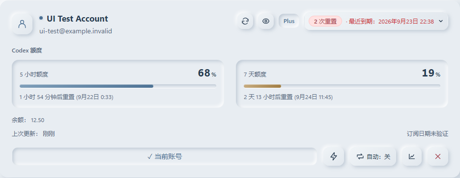
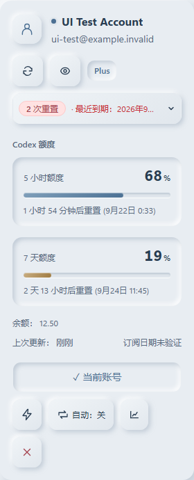
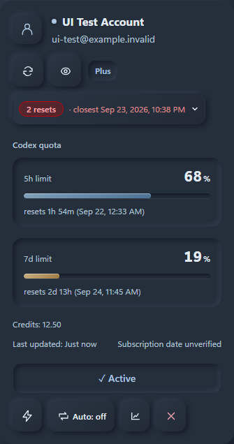
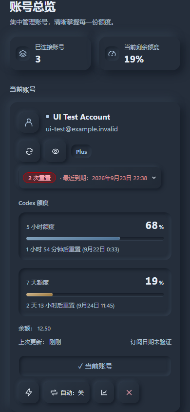

# 额度查询精简验收

2026-09-21：按用户要求，额度查询仅保留 Codex。

移除 ChatGPT / Pro 用量面板、原生查询接口、内置官网连接、系统浏览器助手、快照导入，以及专用样式、文案、测试和旧接入文档。Codex 的 5 小时／每周额度、手动刷新、缓存、使用统计和托盘显示保留。账号登录与订阅识别仍用于 Codex。

本地旧功能已归档到忽略目录 `Temp/removed-chat-quota/`，不参与构建。没有改动账号凭据、浏览器资料或正式安装版；没有发布或 Git push。

## 验证

- TypeScript / Vite 生产构建通过；Rust 单元测试 73 项通过；桌面与 Web 可执行入口 `cargo check --bins --offline` 通过。
- i18n 与重置额度逻辑测试 7 项通过；原有订阅状态及语言切换界面回归通过。
- 实际 React 页面运行于 `http://127.0.0.1:3221`，使用 Playwright Chromium、隔离测试账号和拦截的业务响应。页面截图不是用户账号的当前额度，也不是已安装桌面程序的截图。
- 视口：1000×800、320×568、375×667、390×844，DPR=1；三个手机尺寸启用移动模式和触屏。中英文、浅深色共 16 个状态，无横向溢出和页面运行错误。
- 验证方法：DOM 与请求断言，配合人工查看截图。Codex 刷新后 5 小时剩余从测试值 68% 更新为 53%，每周剩余保持 19%；统计展开后可手动刷新。未出现 Chat 用量入口或请求，已有折叠偏好也不会恢复旧面板。
- 源码与生产前端产物中无旧接口／组件引用。56 个无关源文件与修改前 SHA256 一致。本次不是参考图复刻，不使用像素相似度作为验收门槛。

完整自动化记录在 `Temp/codex-only-qa/report.json`，以下保留代表截图。

